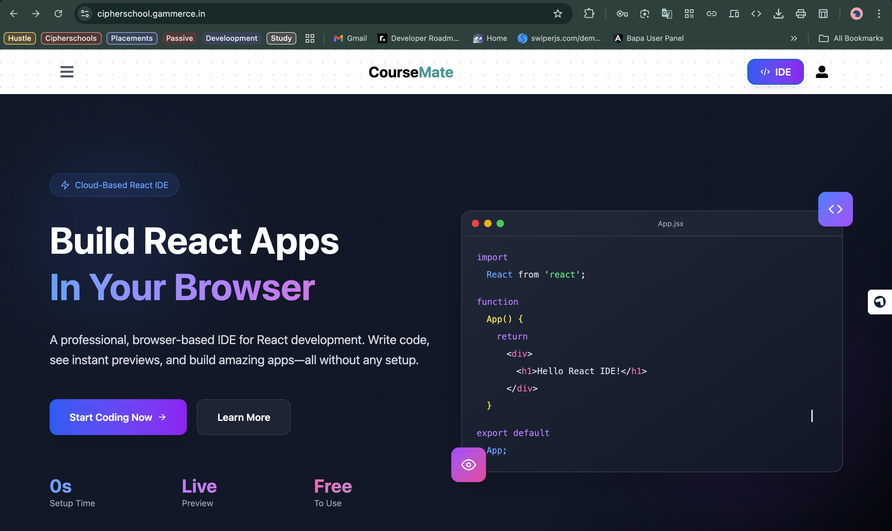
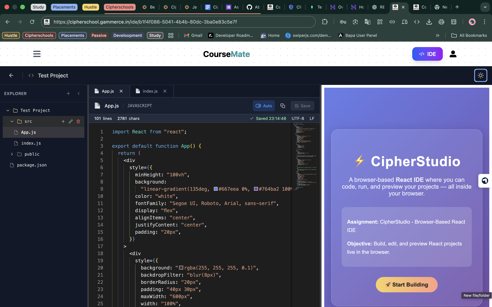
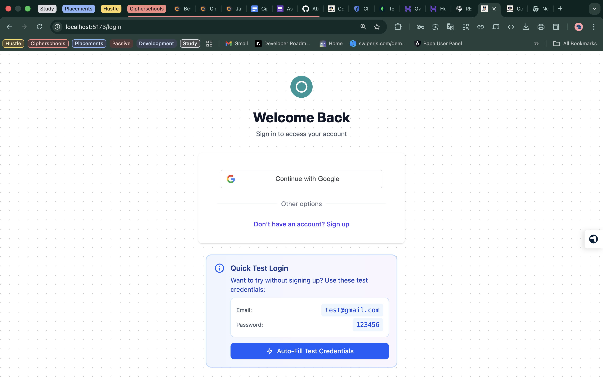

# React IDE - Browser-Based Development Environment

A full-stack web-based React IDE application with live preview, Monaco code editor, and cloud file storage.

---

##  Test Login

```bash
Deployed Link: cipherschool.gammerce.in
```

```bash
Email: test@gmail.com
Password: 123456
```

---

## Demo Video

[](https://www.youtube.com/watch?v=KeSIfLwuJ_w)

## Screenshots

### Dashboard

*Project management dashboard with table/grid view toggle*

### Code Editor

*Monaco editor with live preview and file explorer*

### Auth Page

*Auth Page With Option for Google Auth*

---
## ✨ Features

### Backend
  - Google OAuth 2.0 integration
  - Mobile OTP verification
  - Create, read, update, delete projects
  - Nested file/folder structure
  - CRUD operations on files and folders
  - File tree hierarchy management

### Frontend
  - Responsive design with Tailwind CSS
  - Dark/Light theme toggle

  - Monaco Editor (VS Code-like experience)
  - Syntax highlighting and IntelliSense
  - Auto-save functionality (2-second delay)
  - Code copying functionality
  - Drag-and-drop to open files
  - Resizable panels (explorer, editor, preview)

---

## Project Structure

```
CourseMate/
├── frontend/          # React + Vite frontend
│   ├── src/
│   │   ├── components/
│   │   │   ├── ide/              # IDE components
│   │   │   │   ├── CodeEditor.jsx
│   │   │   │   ├── FileExplorer.jsx
│   │   │   │   └── Preview.jsx
│   │   │   ├── navbar/           # Navigation components
│   │   │   ├── profile/          # User profile components
│   │   ├── context/
│   │   │   ├── globalContext.jsx
│   │   │   └── ideContext.jsx
│   │   ├── pages/
│   │   │   ├── Auth/             # Login/Register
│   │   │   ├── dashboard/        # Dashboard pages
│   │   │   └── Homepage.jsx
│   │   ├── hooks/
│   │   └── routes/
│
└── backend/           # Node.js + Express backend
    ├── controllers/
    │   ├── auth.js
    │   ├── project.js
    │   ├── file.js
    │   ├── s3.js
    │   └── user.js
    ├── models/
    │   ├── user.js
    │   ├── project.js
    │   ├── file.js
    │   └── otp.js
    ├── routes/
    ├── middlewares/
    ├── utils/
    └── server.js
```

---

## Tech Stack

| Technology | Purpose |
|-----------|---------|
| **React 19** | UI framework |
| **Monaco Editor** | Code editor component |
| **Sandpack** | Live React preview |
| **Node.js** | Runtime environment |
| **Express 5** | Web framework |
| **MongoDB** | Database |
| **Google Auth Library** | OAuth 2.0 |
| **AWS SDK v3** | S3 file storage |

---

## License

ISC

---

## Author

**Abdul Rakib**

---
